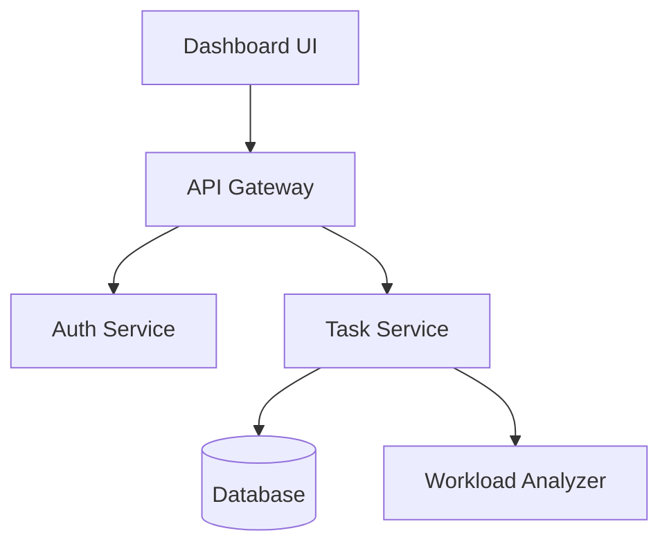

# Workshop 1: Spec → Plan → Design → Code with GitHub Copilot Agents

> **Duration:** 2.5 - 3 hours  
> **Format:** Instructor-led, guided hands-on workshop  
> **Difficulty:** 🟡 Intermediate to 🔴 Advanced  
> **Audience:** Developers, Technical Leads, Architects  
> **Focus:** Applying GitHub Copilot as an agent across the software development lifecycle

---

## 1. Workshop Purpose

This workshop demonstrates a practical approach to using **GitHub Copilot beyond code completion**, by applying it across the full software development lifecycle.

Participants start with a loosely defined problem and progressively move through **specification, planning, design, and implementation**, using Copilot as a reasoning partner at each stage.

The emphasis is on **structure over prompting tricks**—showing how well-defined artifacts enable AI agents to produce more reliable and predictable results.

## 2. Design Principles

- Spec-first, not code-first
- Workflow over tooling
- No live installations during the session
- One continuous use case throughout
- Lightweight, repeatable artifacts
- Explicit alignment between spec, design, and code

---

## 3. Scope Decisions (Intentional)

### ✅ Included

- Copilot Chat for reasoning and generation
- Spec-kit style artifacts (markdown-based)
- Structured prompting patterns
- MCP as a **conceptual model** for shared context

### ❌ Excluded

- Copilot CLI (focus is on structured artifacts, not terminal)
- SDK-based agent orchestration
- Full application deployment
- Complex technical domains

This keeps the workshop focused on **how structure improves AI outputs**, not tooling complexity.

---

## Difficulty & Challenge Levels

| Level | Description | Time Pressure |
|-------|-------------|---------------|
| 🟢 **Core** | Must complete - foundational skills | Guided pace |
| 🟡 **Challenge** | Stretch goals - deeper understanding | Time-boxed |
| 🔴 **Bonus** | Expert level - independent problem solving | Self-paced |

---

## 4. Pre-Provisioned Repository

To keep the workshop focused and on schedule, participants are provided with a pre-configured repository.

The repository includes a **spec-kit-style structure**, implemented as simple markdown files. Spec-kit is used here as a **structuring pattern**, not as a runtime tool or dependency.

```
/workshop-repo
├── spec/                  ← Spec-Kit structure
│   ├── spec.md
│   ├── acceptance.md
│   ├── assumptions.md
│   └── constraints.md
├── plan/
│   └── plan.md
├── design/
│   └── design.md
├── src/
│   └── starter/
├── prompts/               ← Starter prompts
│   ├── spec-agent.md
│   ├── planning-agent.md
│   ├── design-agent.md
│   └── coding-agent.md
└── README.md
```

> **Note:** All documents are intentionally incomplete to support guided completion during the workshop.

---

## 5. Agent Strategy for Spec-Driven Development

Participants work with **four distinct agent roles**:

### 1. 📋 Spec Agent
- Clarifies requirements from ambiguous inputs
- Identifies assumptions and constraints
- Structures acceptance criteria

### 2. 🗺️ Planning Agent
- Breaks requirements into components
- Identifies dependencies and sequencing
- Creates traceable task breakdowns

### 3. 🏗️ Design Agent
- Defines high-level architecture
- Assigns component responsibilities
- Validates design against specification

### 4. 💻 Coding Agent
- Scaffolds implementation from design
- Reviews code for spec alignment
- Advises on refactoring

> Agents are defined via **clear instructions**, not SDKs.

---

## 6. Prompting Approach

This workshop uses **guided prompting** to ensure consistent outcomes while allowing participants to iterate and adapt.

Prompting happens primarily through **GitHub Copilot Chat**, grounded by the repository artifacts. To support a smooth hands-on experience, **starter prompts** are provided for each stage of the workflow.

### These prompts:

- Act as starting points, not scripts
- Describe intent as well as example wording
- Encourage refinement based on evolving context

## 7. Agenda & Flow (2.5 - 3 Hours)

### 1. Introduction: Copilot as an Agent ⏱️ _10 minutes_

**Why typical Copilot usage falls short:**
- Over-reliance on code completion
- Lack of structured inputs
- Inconsistent outputs

**How agent-style workflows help:**
- Better inputs produce better outputs
- Structure enables reasoning
- Artifacts create traceability

#### Flow Overview
```
Spec → Plan → Design → Code → Validate
```

**✅ Outcome:** Shared understanding of structured AI workflows.

---

### 2. Lab 1: Specification with Agents ⏱️ _25 minutes_

Participants begin with a short, ambiguous problem statement.

#### 📝 Problem Statement (Provided)

> "We need an app that helps teams track their work. Something like a task board but smarter. It should know who’s overloaded and suggest what to do next."

---

#### 📖 Step-by-Step Walkthrough

**Step 1: Open the specification files** (2 min)
```
Open these files in your editor:
- spec/spec.md
- spec/acceptance.md  
- spec/assumptions.md
- spec/constraints.md
```

**Step 2: Extract requirements using Copilot Chat** (8 min)

Open Copilot Chat and use this prompt:

```
I have this ambiguous problem statement:

"We need an app that helps teams track their work. Something like a task board but smarter. It should know who’s overloaded and suggest what to do next."

Help me extract structured requirements:
1. List 5-7 functional requirements (what the system must DO)
2. List 3-4 non-functional requirements (performance, security, etc.)
3. Identify ambiguous terms that need clarification
4. Suggest questions I should ask the stakeholder
```

✅ **Expected Output:** A structured list of requirements with clear functional/non-functional separation.

**Step 3: Identify hidden assumptions** (5 min)

Use this follow-up prompt:

```
Based on these requirements, what assumptions are we implicitly making?
List assumptions about:
- Users and their technical ability
- Team size and structure  
- Integration requirements
- Data and privacy
- Deployment environment
```

✅ **Expected Output:** 5-8 explicit assumptions that weren't stated in the original problem.

**Step 4: Define acceptance criteria** (5 min)

Use this prompt:

```
For the top 3 functional requirements, write acceptance criteria using this format:

GIVEN [precondition]
WHEN [action]
THEN [expected result]

Make criteria specific and measurable where possible.
```

**Step 5: Document constraints** (3 min)

Use this prompt:

```
What technical and business constraints should we document?
Consider: timeline, budget, technology stack, team skills, compliance.
```

**Step 6: Update your artifacts** (2 min)
- Copy the extracted requirements to `spec/spec.md`
- Copy acceptance criteria to `spec/acceptance.md`
- Copy assumptions to `spec/assumptions.md`
- Copy constraints to `spec/constraints.md`

---

#### 💡 Tips & Hints

| Challenge | Hint |
|-----------|------|
| 1.1 (5+ requirements) | Look for verbs in the statement: "track", "know", "suggest" |
| 1.2 (hidden assumptions) | Ask: "What would break if this assumption is wrong?" |
| 1.3 (measurable criteria) | Add numbers: "within 2 seconds", "supports 50 users" |
| 1.4 (conflicting requirement) | Look for trade-offs: "smart suggestions" vs "user privacy" |

---

#### ⚠️ Common Pitfalls

- ❌ **Too vague:** "System should be fast" → ✅ "Dashboard loads in <2 seconds"
- ❌ **Solution in requirement:** "Use React" → ✅ "Support modern browsers"
- ❌ **Missing stakeholder:** Forgot to consider managers vs team members

---

**Artifacts updated:**
- `spec/spec.md`
- `spec/acceptance.md`
- `spec/assumptions.md`
- `spec/constraints.md`

#### 🎯 Challenges

| # | Challenge | Difficulty | Points |
|---|-----------|------------|--------|
| 1.1 | Extract 5+ functional requirements from the ambiguous statement | 🟢 Core | 10 |
| 1.2 | Identify 3+ hidden assumptions the stakeholder didn't mention | 🟢 Core | 10 |
| 1.3 | Define 3+ measurable acceptance criteria with specific thresholds | 🟡 Challenge | 15 |
| 1.4 | Identify a conflicting requirement and propose resolution | 🔴 Bonus | 20 |

**✅ Outcome:** A clear, structured specification that both humans and AI agents can reason over.

---

### 3. Lab 2: Planning from the Specification ⏱️ _25 minutes_

Participants derive an execution plan directly from the completed specification.

---

#### 📖 Step-by-Step Walkthrough

**Step 1: Review your specification** (2 min)
```
Open spec/spec.md and review the requirements you documented.
Highlight the 3-4 most critical requirements.
```

**Step 2: Break down into components** (8 min)

Open Copilot Chat with your spec file and use this prompt:

```
Based on @spec.md, help me break this system into logical components.

For each component, provide:
1. Component name
2. Primary responsibility (one sentence)
3. Key requirements it addresses (reference requirement IDs)
4. Dependencies on other components

Aim for 4-6 components with clear boundaries.
```

✅ **Expected Output:** A component breakdown table with clear responsibilities.

**Step 3: Create dependency graph** (5 min)

Use this follow-up prompt:

```
Create a dependency graph for these components:
1. Which components must be built first?
2. Which can be built in parallel?
3. What are the integration points?

Format as a simple ASCII diagram or Mermaid flowchart.
```

✅ **Example Output:**
```
[Auth] → [User Service] → [Task Service]
                    ↓
            [Dashboard UI]
                    ↓
          [Analytics Engine]
```

**Step 4: Estimate effort and identify critical path** (5 min)

Use this prompt:

```
For each component, estimate:
- Relative effort: Small (1-2 days) / Medium (3-5 days) / Large (1-2 weeks)
- Risk level: Low / Medium / High
- Dependencies that could block progress

Identify the critical path - the longest sequence of dependent tasks.
```

**Step 5: Create task breakdown** (3 min)

Use this prompt:

```
Convert the component plan into a task breakdown:
1. Group tasks by phase (Foundation, Core Features, Polish)
2. Add acceptance criteria reference for each task
3. Identify which tasks can be done in parallel
```

**Step 6: Update plan artifact** (2 min)
- Copy the component breakdown to `plan/plan.md`
- Include the dependency graph
- Add the task breakdown with phases

---

#### 💡 Tips & Hints

| Challenge | Hint |
|-----------|------|
| 2.1 (4+ components) | Think in layers: UI, API, Business Logic, Data |
| 2.2 (dependency graph) | Start with "what needs to exist before X can work?" |
| 2.3 (critical path) | Find the longest chain of sequential dependencies |
| 2.4 (parallel workstreams) | UI and backend can often be built in parallel |

---

#### ⚠️ Common Pitfalls

- ❌ **Circular dependencies:** A depends on B, B depends on A
- ❌ **Missing integration tasks:** Plan components but forget integration work
- ❌ **Optimistic estimates:** Add buffer for unknowns

---

**Artifact updated:**
- `plan/plan.md`

#### 🎯 Challenges

| # | Challenge | Difficulty | Points |
|---|-----------|------------|--------|
| 2.1 | Break solution into 4+ logical components with clear boundaries | 🟢 Core | 10 |
| 2.2 | Create dependency graph showing component relationships | 🟢 Core | 10 |
| 2.3 | Identify critical path and estimate relative effort | 🟡 Challenge | 15 |
| 2.4 | Propose parallel workstreams and identify merge points | 🔴 Bonus | 20 |

**✅ Outcome:** A plan that is explicitly traceable to the original requirements.

---

### 4. Lab 3: Design with Validation ⏱️ _30 minutes_

Participants create a simple but structured design.

---

#### 📖 Step-by-Step Walkthrough

**Step 1: Review plan and identify design scope** (2 min)
```
Open plan/plan.md and identify:
- The core components you'll design
- Key integration points between components
```

**Step 2: Define high-level architecture** (8 min)

Open Copilot Chat with your plan file and use this prompt:

```
Based on @plan.md, help me create a high-level architecture.

Define:
1. Architecture style (monolith, microservices, serverless, etc.)
2. Key components and their responsibilities
3. Data flow between components
4. External integrations

Create a simple architecture diagram using ASCII or Mermaid.
```

✅ **Example Output (Mermaid):**


**Step 3: Define component interfaces** (8 min)

Use this prompt:

```
For the Task Service and one other core component, define:

1. API endpoints (REST style):
   - Method, Path, Request body, Response
   
2. Key data models:
   - Entity name, properties, relationships

Use JSON examples for clarity.
```

✅ **Example Output:**
```
POST /api/tasks
Request: { "title": string, "assignee": string, "priority": number }
Response: { "id": string, "created": timestamp, ... }
```

**Step 4: Create traceability matrix** (5 min)

Use this prompt:

```
Create a traceability matrix showing:

| Requirement ID | Requirement | Design Component | How Addressed |

Map each key requirement to the design element that fulfills it.
```

**Step 5: Identify design trade-offs** (5 min)

Use this prompt:

```
Identify 2-3 design trade-offs we're making:

For each trade-off:
1. What we chose
2. What we gave up
3. Why this makes sense for our context

Example: "Chose SQL over NoSQL for data consistency, giving up flexible schema."
```

**Step 6: Update design artifact** (2 min)
- Copy architecture diagram to `design/design.md`
- Add API definitions
- Include traceability matrix
- Document trade-offs

---

#### 💡 Tips & Hints

| Challenge | Hint |
|-----------|------|
| 3.1 (architecture diagram) | Keep it simple - 5-7 boxes maximum |
| 3.2 (API contracts) | Focus on the "happy path" first |
| 3.3 (traceability) | Every requirement should map to something |
| 3.4 (trade-offs) | Think: performance vs simplicity, consistency vs availability |
| 3.5 (alternative) | What if we used serverless? What if we used a different DB? |

---

#### ⚠️ Common Pitfalls

- ❌ **Over-engineering:** Don't design for scale you don't need yet
- ❌ **Missing error cases:** What happens when the API fails?
- ❌ **No validation:** Design should clearly satisfy requirements

---

**Artifact updated:**
- `design/design.md`

#### 🎯 Challenges

| # | Challenge | Difficulty | Points |
|---|-----------|------------|--------|
| 3.1 | Create architecture diagram with component interactions | 🟢 Core | 10 |
| 3.2 | Define API contracts for 2+ component interfaces | 🟢 Core | 10 |
| 3.3 | Create traceability matrix: requirements → design decisions | 🟡 Challenge | 15 |
| 3.4 | Identify 2+ design trade-offs and justify your choices | 🟡 Challenge | 15 |
| 3.5 | Propose alternative architecture and compare pros/cons | 🔴 Bonus | 25 |

**✅ Outcome:** A design that clearly satisfies the documented requirements.

---

### 5. Lab 4: Implementation with Copilot Agents ⏱️ _35 minutes_

Participants move from design to code, using Copilot as:

- A scaffolding assistant
- A reviewer for spec alignment
- A refactoring advisor

---

#### 📖 Step-by-Step Walkthrough

**Step 1: Set up project structure** (5 min)

Open Copilot Chat with your design file and use this prompt:

```
Based on @design.md, generate the project folder structure.

Include:
1. Source folders for each component
2. Test folders
3. Configuration files
4. README with setup instructions

Use [TypeScript/Python/your language] conventions.
```

✅ **Expected Output:** A complete folder structure you can create in `src/`.

**Step 2: Scaffold core data models** (8 min)

Use this prompt:

```
Generate the data models from our design:

1. Task model with all properties
2. User model  
3. Any enums or types needed

Include:
- Type definitions
- Validation rules
- Example instances
```

**Step 3: Implement a core service** (10 min)

Use this prompt:

```
Implement the TaskService based on @design.md:

1. CRUD operations for tasks
2. Method to get tasks by assignee
3. Method to calculate workload per user

Include:
- Input validation
- Error handling
- JSDoc/docstring comments
```

✅ **Checkpoint:** You should have working code for creating, reading, updating, deleting tasks.

**Step 4: Add input validation and error handling** (7 min)

Use this prompt:

```
Review the TaskService implementation and add:

1. Input validation for all public methods
2. Custom error types for common failures
3. Proper error messages for debugging

Follow the principle: "Fail fast, fail loud, fail helpfully."
```

**Step 5: Write unit tests** (5 min)

Use this prompt:

```
Generate unit tests for TaskService:

1. Test each CRUD operation
2. Test edge cases (empty input, invalid data)
3. Test error scenarios

Use [Jest/pytest/your framework] conventions.
```

---

#### 💡 Tips & Hints

| Challenge | Hint |
|-----------|------|
| 4.1 (project structure) | Ask Copilot to explain each folder's purpose |
| 4.2 (2+ components) | Start with the simplest component first |
| 4.3 (validation) | Think: What could a user send that would break this? |
| 4.4 (unit tests) | Test the boundary cases, not just happy path |
| 4.5 (stretch feature) | Add a simple notification or export feature |

---

#### ⚠️ Common Pitfalls

- ❌ **Code without understanding:** Don't just copy - understand what Copilot generates
- ❌ **Skipping validation:** Users will send bad data - handle it
- ❌ **No tests:** Even basic tests catch obvious bugs

---

#### 🎯 Challenges

| # | Challenge | Difficulty | Points |
|---|-----------|------------|--------|
| 4.1 | Scaffold complete project structure matching design | 🟢 Core | 10 |
| 4.2 | Implement 2+ core components with working code | 🟢 Core | 15 |
| 4.3 | Add input validation and error handling | 🟡 Challenge | 15 |
| 4.4 | Write unit tests for at least one component | 🟡 Challenge | 15 |
| 4.5 | Implement stretch feature not in original spec | 🔴 Bonus | 25 |

**✅ Outcome:** A minimal working implementation aligned with the original specification.

---

### 6. Lab 5: Validation and Alignment Review ⏱️ _15 minutes_

**Goal:** Ensure implementation aligns with specification.

---

#### 📖 Step-by-Step Walkthrough

**Step 1: Create alignment checklist** (5 min)

Open Copilot Chat with both spec and source files:

```
Compare @spec.md with our implementation in src/.

Create an alignment checklist:
| Requirement | Status | Evidence | Notes |

Status options: ✅ Complete, ⚠️ Partial, ❌ Missing
```

✅ **Expected Output:** A table showing each requirement's implementation status.

**Step 2: Identify spec drift** (5 min)

Use this prompt:

```
Analyze the implementation for spec drift:

1. Features we implemented that weren’t in the spec
2. Spec requirements we didn’t fully implement
3. Assumptions we made during coding that differ from spec

For each drift, note if it’s intentional or accidental.
```

**Step 3: Generate validation tests** (5 min)

Use this prompt:

```
Based on @acceptance.md, generate automated tests:

1. Convert each acceptance criterion to a test case
2. Include setup and teardown
3. Add assertions that match the "THEN" clauses
```

---

#### 💡 Tips & Hints

| Challenge | Hint |
|-----------|------|
| 5.1 (alignment checklist) | Be honest - partial is okay at this stage |
| 5.2 (spec drift) | Look for "while I was at it" additions |
| 5.3 (fix gaps) | Prioritize critical requirements first |
| 5.4 (auto validation) | Acceptance criteria ARE your test cases |

---

Participants use Copilot to:

- Compare code against the specification
- Identify missing or partially implemented requirements
- Detect areas of potential spec drift

#### 🎯 Challenges

| # | Challenge | Difficulty | Points |
|---|-----------|------------|--------|
| 5.1 | Create alignment checklist: spec requirement → implementation status | 🟢 Core | 10 |
| 5.2 | Identify and document 2+ spec drift areas | 🟡 Challenge | 15 |
| 5.3 | Propose fixes for identified gaps | 🟡 Challenge | 15 |
| 5.4 | Generate automated validation tests from acceptance criteria | 🔴 Bonus | 25 |

**✅ Outcome:** Verified alignment between spec and implementation.

---

## 8. MCP Context Model (Conceptual)

For spec-driven development, shared context includes:

| Context Element | Purpose |
|-----------------|---------|
| Specification | Requirements and acceptance criteria |
| Assumptions | Explicit assumptions made |
| Constraints | Technical and business boundaries |
| Plan | Task breakdown and sequencing |
| Design | Architecture and component responsibilities |

> MCP is presented conceptually—participants capture context in markdown artifacts.

---

## 9. Success Criteria

By the end of this workshop, participants will have:

- [ ] Created a structured specification from ambiguous requirements
- [ ] Derived an explicit plan traceable to requirements
- [ ] Designed a solution validated against the spec
- [ ] Implemented core functionality aligned with design
- [ ] Validated implementation against original specification
- [ ] Understood how structure improves AI agent outputs

---

## 10. Scoring & Achievement Levels

### Point Breakdown

| Category | Points Available |
|----------|------------------|
| 🟢 Core Challenges | 95 points |
| 🟡 Challenge Tasks | 120 points |
| 🔴 Bonus Tasks | 115 points |
| **Total Possible** | **330 points** |

### Achievement Levels

| Level | Points | Badge |
|-------|--------|-------|
| 🥇 **Spec Master** | 280+ | Exceptional spec-driven development skills |
| 🥈 **Architect** | 200-279 | Strong end-to-end workflow execution |
| 🥉 **Builder** | 120-199 | Solid foundational understanding |
| **Participant** | <120 | Completed core workshop activities |

### Time Bonuses

| Completion Time | Bonus |
|-----------------|-------|
| Under 2 hours | +30 points |
| Under 2.5 hours | +15 points |

---

## Appendix: Starter Prompts

### Specification Prompt
```
Given this problem statement:

[Problem statement]

Help me create a structured specification by:
1. Clarifying ambiguous requirements
2. Identifying assumptions we need to make
3. Defining constraints (technical, time, scope)
4. Writing clear acceptance criteria

Ask clarifying questions if needed.
```

### Planning Prompt
```
Based on this specification:

[Specification summary]

Create an execution plan that:
1. Breaks the solution into logical components
2. Identifies dependencies between components
3. Sequences tasks appropriately
4. Maps each task back to a requirement

Keep the plan lightweight and actionable.
```

### Design Prompt
```
Given this plan:

[Plan summary]

Create a high-level design that:
1. Defines the architecture approach
2. Assigns responsibilities to components
3. Outlines key interfaces or data models
4. Validates coverage of all requirements

Highlight any design decisions that need confirmation.
```

### Implementation Prompt
```
Based on this design:

[Design summary]

Help me implement [component name] by:
1. Scaffolding the basic structure
2. Implementing core functionality
3. Following the patterns established in the design
4. Flagging any spec alignment concerns

Keep the implementation minimal but complete.
```

### Validation Prompt
```
Compare this implementation against the original specification:

Specification: [spec summary]
Implementation: [code or description]

Identify:
1. Requirements that are fully implemented
2. Requirements that are partially implemented
3. Requirements that are missing
4. Any spec drift or deviations
```
